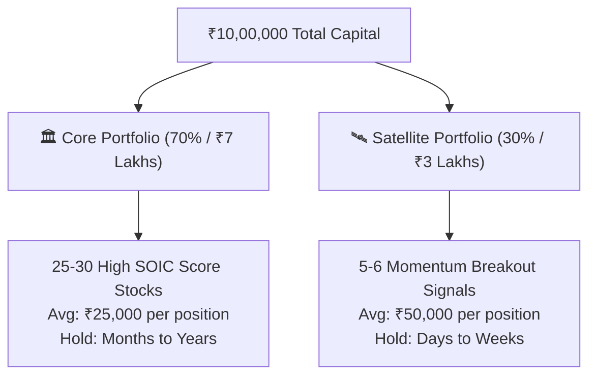
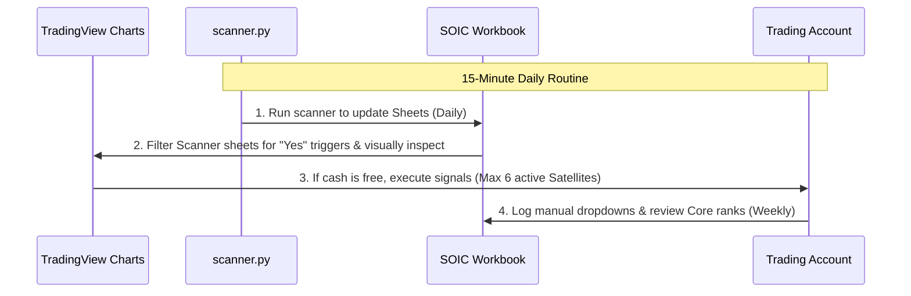

# 📊 Core-Satellite Capital Management Guide (₹10 Lakhs Portfolio)

This guide provides a professional risk-management framework to organize and execute your investments using the **Core-Satellite Framework** designed specifically for a ₹10 Lakhs capital base.

---

## 🏛️ 1. Core vs. Satellite Architecture

To hold **25–30 high-conviction stocks** while simultaneously taking advantage of fresh daily momentum breakout signals, divide your capital into two distinct sub-portfolios:

### 🏛️ The Core Portfolio (70% - ₹7,00,000)
* **Objective:** Steady compounders with high quality, low debt, and strong fundamental tailwinds.
* **Selection:** Top-ranked stocks from your **`SOIC Non Financial`** and **`SOIC Banks NBFC`** sheets with the highest total scores (calculated by the Excel sheet).
* **Position Count:** 25–30 stocks.
* **Allocation:** Average of **₹23,000 – ₹28,000** per stock (approx. 2.5% of total capital per position).
* **Holding Period:** Long-term (6 months to multiple years, reviewed quarterly).

### 🛰️ The Satellite Portfolio (30% - ₹3,00,000)
* **Objective:** Capture short-term breakout momentum and volume spikes.
* **Selection:** Fresh daily alerts generated by **`scanner.py`** and captured in your new **`Scanner Non Financial`** and **`Scanner Banks NBFC`** sheets.
* **Position Count:** 5–6 stocks max at any time.
* **Allocation:** **₹50,000 – ₹70,000** per stock (approx. 5% – 7% of total capital per position, matching the scanner's dynamic sizing!).
* **Holding Period:** Short-term (Days to weeks, trailing stops applied).

---

## 🔄 2. Dynamic Cash Flow & Signal Management

Because fresh breakout signals appear daily in your scanner, you must establish strict rules to prevent **over-trading** and **capital dilution**.

### The "One In, One Out" Rule
* **Limit:** Never hold more than **6 active Satellite positions** at any time.
* **Action:** If you already have 6 active Satellite trades and a new high-scoring signal appears:
  1. Do **not** buy it using Core capital.
  2. Compare the new signal's `Entry Score` to your current positions.
  3. You may exit your weakest underperforming satellite position (or one that has hit a trailing stop) to free up ₹50k cash for the new entry.

### Stop-Loss and Trailing Stop Protocol (Satellite Only)
Since you are buying breakouts near All-Time Highs (ATH), protecting your capital is paramount:
1. **Initial Stop-Loss (V-stop):** Set your initial stop-loss at the calculated **`Calculated V-stop Line`** in your sheet. If a weekly candle closes below this line, exit immediately—no exceptions.
2. **Time Stop (90 Days):** If a satellite stock does not move at least **+10% within 90 days**, exit and recycle the capital into a fresh signal.
3. **Trailing Stop:** Once a stock is up **+20%**, shift your stop-loss to cost price (Break-even). Trail it behind the weekly V-stop line as the price climbs.

---

## 🛠️ 3. Step-by-Step Daily Execution Workflow

Follow this 15-minute daily routine to keep your portfolio highly optimized:

1. **Morning (Review Excel):** Open `outputs/soic_chartink_ranking_YYYY-MM-DD.xlsx`. Check the new **`Scanner Non Financial`** sheet. Look at the top 3–5 stocks sorted by `Entry Score`.
2. **Chart Verification (TradingView):** Search for those tickers on TradingView. Confirm that:
   * Price is trading above the weekly 30 EMA.
   * RSI is strong (> 60).
   * Price is above the weekly V-stop trailing stop.
3. **Order Placement:**
   * If a **`🟢 CROSS`** is active and you have cash: Deploy **₹70,000**.
   * If a **`🟡 NEW_HIGH`** is active and you have cash: Deploy **₹50,000**.
4. **Maintenance:** Every weekend, run the ranker to review your **Core Portfolio** ranks. If a Core stock's score deteriorates significantly (e.g., dropping below 40 total points), plan to phase it out and replace it with a fresh high-scoring SOIC stock.

---

> [!TIP]
> **Keep Core and Satellite separate in your broker console.** Many modern brokers allow you to create "baskets" or "tags". Tag your core holdings as `#Core` and signal breakouts as `#Satellite` to track their performance independently and avoid mixing long-term compounding with short-term trading psychology.
